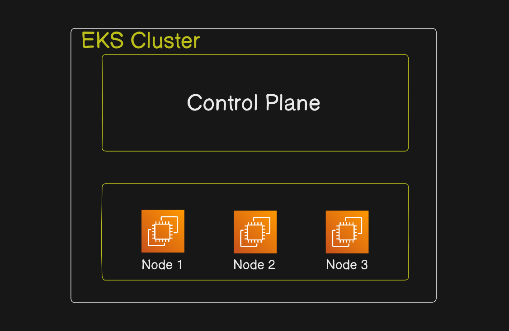
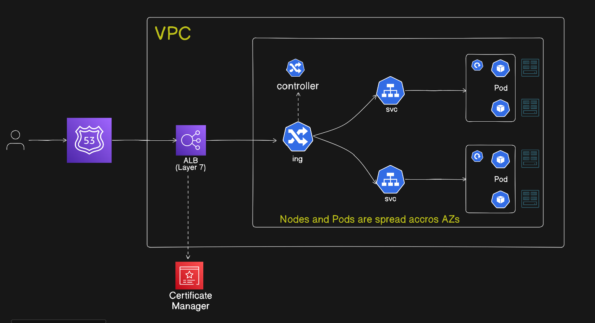
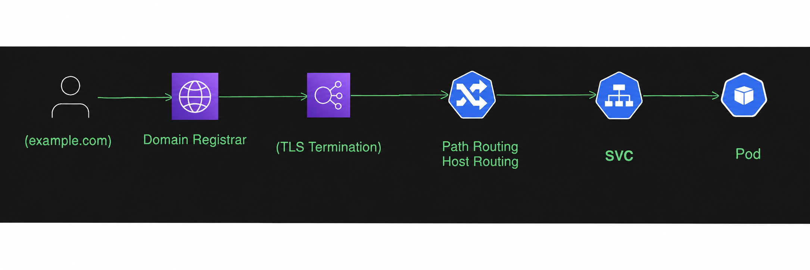

# **Production-Grade AWS EKS Deployment with ALB, TLS & Route53 (Terraform Automated)**

## 📌 Overview

This project provisions a production-ready private Amazon EKS cluster using Infrastructure as Code (Terraform) and deploys microservices using Kubernetes with:
- AWS Load Balancer Controller (ALB)
- Kubernetes Ingress
- TLS termination using ACM
- GoDaddy DNS configuration
- Path-based routing
- Host-based routing
- Bastion host for secure access

The entire infrastructure layer is automated using Terraform.

## Architecture
Core AWS Services Used
- Amazon EC2
- AWS IAM
- AWS VPC
- Amazon EKS
- AWS Application Load Balancer
- Amazon Certificate Manager (ACM)






## Infrastructure Provisioned with Terraform
### Networking (Custom VPC)
- VPC
- Public Subnets
- Private Subnets
- Internet Gateway (IGW)
- EIP
- NAT Gateway
- Route Tables
- Security Groups

#### Architecture model:
```
Public Subnet:
  - Bastion Host
  - NAT Gateway
  - ALB

Private Subnet:
  - EKS Worker Nodes
```

### Private EKS Cluster
- Private Endpoint Enabled
- IAM Roles & Policies
- OIDC Provider
- IRSA (IAM Roles for Service Accounts)
- Managed Node Groups

#### Security-first design:
- No public access to worker nodes
- Access only via Bastion host

### Bastion Host
Used for:
- Secure SSH access
- Kubectl access to private cluster
- Helm installation
- Controller installation

# **Prerequisites Setup for This Repository (AWS CLI + Terraform via Chocolatey)**

Before running this EKS Terraform project, install the required tools on your system using Chocolatey.

# **1. Install Chocolatey (if not already installed)**

**Open PowerShell as Administrator and install Chocolatey:**
```shell

Set-ExecutionPolicy Bypass -Scope Process -Force; [System.Net.ServicePointManager]::SecurityProtocol = [System.Net.ServicePointManager]::SecurityProtocol -bor 3072; ` iex ((New-Object System.Net.WebClient).DownloadString('https://community.chocolatey.org/install.ps1'))

```

**Verify installation:**

```shell
choco -v
```

# **2. Install AWS CLI using Chocolatey**

**Install AWS CLI:**
```shell
choco install awscli -y
```

**Verify:**
```shell
aws --version
```

# **3. Install Terraform using Chocolatey**

**Install Terraform:**
```shell
choco install terraform -y
```
**Verify:**
```shell
terraform -version
```
# **EKS Project Run Steps (Terraform)**

## **1.Clone the repository to local: create a empty directory in local .Then clone it**

or 
## **In vs code-->click on terminal-->new terminal-->select git bash-->change to local directory --> run git clone command-->after cloning finished--->cick on file-->open Folder-->select your cloned repository**
```shell
git clone https://github.com/RupaEnggVille/PRODUCTION-EKS.git

cd PRODUCTION-EKS
```
## **2. Go to Terraform working directory**

Based on instructions:
```shell
ls
cd eks-project
ls
cd terraform
ls
cd eks
```
Make sure this folder contains: main.tf ,eks.tf,vpc.tf,provider.tf,dev.tfvars

## **3. Configure AWS CLI (mandatory):** 
Navigate to AWS IAM Console --> Create an IAM user (eks-user) in aws console for this project --> Create and save access key and secret keys locally
```shell
aws configure

#Set:

AWS Access Key : give your access key
Secret Key     : give your secret key
Region         : us-east-1
Output Format  : json
```
## **4. Create S3 backend bucket (if not already created)**

Through aws console or through CLI command
```shell
aws s3 mb s3://your-terraform-state-bucket --region us-east-1
```

In **backend.tf** change the bucket name 

bucket       = "backend-bucket-final-1805"   #create s3 bucket through aws console and replace bucket name here

Update the region based on your AWS region. in backend block 


### In dev.tfvars 

Change Ami id of Ubuntu Server Based on region

ami_id        = "ami-091138d0f0d41ff90"  #replace with your ubuntu ami id based on region

Instance type based on your project size

instance_type = "t3.medium"  #change instance type

aws_region    = "us-east-1"   #change region

Cluster node instance_type  = ["t3.medium"]  #change instance type

if required also change 

kubernetes_version        = "1.34" 

## **5. Create EC2 Key Pair (VERY IMPORTANT)**
For creating key pair check it in ec2.tf file which block you are using in the project.

If you are using data block 
```
data "aws_key_pair"
```
Then key MUST already exist in AWS EC2 Console.**(create manually through aws console)**

If you use resource block
```
resource "aws_key_pair"
```
Generate through ssh-keygen

### Step 1: Create local key
```shell
ssh-keygen -t rsa -b 4096 -f ~/.ssh/ec2_keypair
```

### Step 2: Import into AWS
```shell
aws ec2 import-key-pair \
  --key-name ec2_keypair \
  --public-key-material fileb://~/.ssh/ec2_keypair.pub \
  --region us-east-1
```

### Step 3: Verify
```shell
aws ec2 describe-key-pairs --key-names ec2_keypair
```

## **6. Initialize Terraform**
```shell
terraform init
```  
This will: download AWS provider ,initialize backend (S3), initialize modules

## **7. Validate configuration**
```shell
terraform validate
```

## **8. Plan infrastructure**
```shell
terraform plan -var-file="dev.tfvars"    #because all global configuration settings are defined in dev.tfvars. If you run only terraform plan, it will prompt you to enter values manually.”
```
We use dev.tfvars with terraform plan so Terraform already knows all values. If we don’t use it, Terraform will stop and ask us to enter them one by one.

## **9. Apply infrastructure**
```shell
terraform apply -var-file="dev.tfvars"

Type:yes
```
After resource creation completes, verify in the AWS Console that the bastion server, cluster, Cluster nodes, VPCs & IAM Roles are available. The process usually takes 10–15 minutes. Then copy the bastion server’s public IP address and launch a new Git Bash session.

## **10. Post Deployment (Bastion Access & Kubernetes Setup)**
Connect to EKS Cluster Via Bastion because cluster is private.

Prerequisites for Secure Access to cluster from Bastion: Before starting, ensure the following are installed and configured:

- Kubernetes Cluster (Amazon EKS)
- kubectl
- Helm
- eksctl
- AWS CLI
- IAM permissions for EKS and ELB creation

### **Step:1 SSH into Baston server **
```shell
ssh -i Downloads/key_pair.pem ubuntu@bastion_public_ip
```

(example: ssh -i Downloads/test-key.pem ubuntu@(bastion_public_ip))

### **Step:2 Configure AWS access**
```shell
aws configure    #enter here access keys and secret keys ,region and output format

AWS Access Key : give your saved access key

Secret Key  : give your saved secret key

Region → us-east-1 #change region

Output → json 
```

### **Step:3 Configure Kubernetes Access (EKS)**

Update kube Config file of EKS cluster to access it from Bastion (Replace region, cluster name)
```shell
aws eks update-kubeconfig --region us-east-1 --name dev-eks-demo
```

### **Step:4 Verify EKS Cluster Access:**
```shell
kubectl get nodes
```

## **11. Install Helm (inside bastion)**
```shell
curl -fsSL -o get_helm.sh https://raw.githubusercontent.com/helm/helm/main/scripts/get-helm-3
chmod 700 get_helm.sh
./get_helm.sh
```

## **12. Install AWS Load Balancer Controller**
**Step 1: Add repo for eks using helm & update helm repos**
```shell
helm repo add eks https://aws.github.io/eks-charts
helm repo update
```
**Step 2: Install AWS-ELB-Controller for EKS cluster**
```shell
helm install aws-load-balancer-controller eks/aws-load-balancer-controller \
  -n kube-system \
  --set clusterName=dev-eks-demo \
  --set region=us-east-1 \
  --set vpcId=(vpc-id) \
  --set serviceAccount.annotations."eks\.amazonaws\.com/role-arn"=(IAM-role-arn)
```

replace with your clustername ,vpc id and iam role of loadbalancer(search in aws console iam-->roles-->search  AWSLoadBalancerControllerRole   copy the arn ) and remove () also.
**Step 3: Verify Controller Deployment**
```shell
kubectl get deployment -n kube-system
```

## **13. Clone your repository on the Bastion Server for microservices deployment**
```shell
git clone "https://github.com/RupaEnggVille/PRODUCTION-EKS.git"
cd PRODUCTION-EKS
ls
cd EKS-Project
ls
cd k8s
```

## **14. Deploy Microservices for path based routing  or Set up microservices deployment with path-based routing.**
```shell
kubectl apply -f ns.yaml
kubectl apply -f product.yaml
kubectl apply -f cart.yaml
kubectl apply -f payments.yaml
vim ingress.yaml
```

Comment the following 3 annotations in ingress.yaml file because these annotations are used for HTTPS and SSL certificate setup.
```shell
alb.ingress.kubernetes.io/listen-ports: '[{"HTTPS": 443}, {"HTTP": 80}]'
alb.ingress.kubernetes.io/certificate-arn: arn:aws:acm:us-east-1:071325923620:certificate/e6c8ab5f-3dcd-42b6-bbbb-2ff4e2b811fc
alb.ingress.kubernetes.io/ssl-redirect: '443'
```

**Ingress Deployment (HTTP ALB)**
```shell
kubectl apply -f ingress.yaml    #An Application Load Balancer will be created now
```

**Verify Ingress Load Balancer**
```shell
kubectl get ingress -n e-commerce
```
**You will see:**

**ALB DNS name → k8s-default-xxxx.elb.amazonaws.com**

Before testing ELB DNS name in browser check it in aws console-->ec2-->load balncer-->provisioning or active.
After the state change to active then test the ALB DNS Name in browser.

**Test in browser:**
```text
http://<ALB-DNS>          ---> payments
http://<ALB-DNS>/cart     ---> cart
http://<ALB-DNS>/product  ---> products
```

**ALB path-based routing** From your ALB rules: 
```
/product → product target group
/cart → cart target group
/ → payments (default)
```
## **15. Add DNS in Godaddy**
**Step-1: Create CNAME record in GoDaddy for Payments(Domain Registrar)**
Create a CNAME record in Godaddy for payments service as it is mentioned as the root path in ingress.yaml file.
```
Open godaddy.com  --> Domain -->DNS  ---> Add New Record  -->
Type : CNAME 

Name : payments

value: ALB DNS Name
```
**Step-2: Verify in Browser:**
Wait for sometime to propagate the changes
```text
http://payments.enggville.xyz          ---> payments
http://payments.enggville.xyz/cart     ---> cart
http://payments.enggville.xyz/product  ---> products
```

## **16. HTTPS Setup** (ACM + GoDaddy)  Enable TLS (HTTPS Setup)
 
### **step 1: Request an acm certificate in aws console**

choose Request a public certificate  --> click on next --> Fully qualified domain name : your godaddy domainname (*.enggville.xyz)

click on request

Certificate Status --> pending validation

### **step 2: Add DNS Record in GoDaddy**
```
Open godaddy.com  --> Domain -->DNS  ---> Add New Record  -->

Type: CNAME 

Name : Copy CNAME Name upto before .enggville.xyz (.domainname)  from aws console --->Paste it here

value: Copy CNAME value from aws console (completly)  -->paste it here
```
After completing the above steps, the certificate status in the AWS Console changes from Pending Validation to Issued.

**Check ACM Region:** Make sure certificate is in "us-east-1 (N. Virginia)". ACM region should be same as ALB

## **17. Enable HTTPS Ingress**

Now we will connect the AWS Load Balancer to Kubernetes. Open the ingress.yaml file, uncomment the following lines, and update the certificate ARN with your own value. After making the changes, save the file.

open ingress.yaml file
```shell
vim ingress.yaml
```
**uncomment the following lines** 
```shell
alb.ingress.kubernetes.io/listen-ports: '[{"HTTPS": 443}, {"HTTP": 80}]'
alb.ingress.kubernetes.io/certificate-arn: arn:aws:acm:us-east-1:071325923620:certificate/e6c8ab5f-3dcd-42b6-bbbb-2ff4e2b811fc    #Replace the certificate ARN with your own from AWS Certificate Manager
alb.ingress.kubernetes.io/ssl-redirect: '443'
```
**save the file  :wq!**

**Apply the ingress manifest**
```shell
kubectl apply -f -ingress.yaml
kubectl get ingress -n e-commerce
```

**Test it in browser for Path-Based Routing**
```text
https://payments.enggville.xyz          ---> payments
https://payments.enggville.xyz/cart     ---> cart
https://payments.enggville.xyz/product  ---> products
```

**To test https with ALB DNS Name:** remove CNAME record created in GoDaddy & test it with ALB DNS.
```text
https://<ALB-DNS>          ---> payments
https://<ALB-DNS>/cart     ---> cart
https://<ALB-DNS>/product  ---> products
```
# **18. Host-Based Routing Setup:**
## **Option-1: Apply hostbased-ingress**
```shell
vim hostbased-ingress.yaml
```
Apply hostbased-ingress.yaml file by replacing acm certicate arn with your certificate arn. 
If applying hostbased-ingress make sure to delete path-based ALB & create a new alb for host based.

**To delete Ingress Load Balancer:**
```shell
kubectl delete ingress e-commerce-ingress -n e-commerce #syntax kubectl delete ingress IngressName -n NameSPaceName
```
#replace this (ingress name) with your ingress name

**Apply Host-Based Ingress:**
```shell
kubectl apply -f hostbased-ingress.yaml
```

## ** Option-2: Edit the existing Path-Based Ingress file with Host-Based rules**
```shell
vim ingress.yaml    #replace the content with host-based ingress content.

kubectl apply -f ingress.yaml
```
**Note:**
Change the path to /html/index.html in the deployments for both cart & product  #remove /cart & /product in deployments of cart & product.
In Deployments of cart & product it should look like this
```
mkdir -p /usr/share/nginx/html
cat > /usr/share/nginx/html/index.html
```
Also in Services of cart & product change the health-check path under annotations to /index.html   # remove /cart or /product from service annotations.

No changes are required for payments as the default path used is /index.html in payments. payments.yaml is same for both path-based & host-based routing.

```shell
kubectl apply -f cart.yaml 
kubectl apply -f product.yaml
kubectl apply -f payments.yaml
kubectl apply -f ingress.yaml
kubectl get ingress -n e-commerce
```

You will see:
```shell
NAME                     HOSTS                        ADDRESS
e-commerce-ingress    cart.enggville.xyz,..     abc123.us-east-1.elb.amazonaws.com
```
```shell
kubectl describe ingress e-commerce-ingress -n e-commerce   #This command is optional (for debugging)
```

## **Add DNS Records in Godaddy**
**Step-1: Create 3 CNAME records in GoDaddy for Payments, cart & product (Domain Registrar)**
```
Open godaddy.com  --> Domain -->DNS  ---> Add New Record  -->
Type: CNAME       Name: cart          Value: alb DNS name 

Type: CNAME       Name: product       Value: alb DNS name 

Type: CNAME       Name: payments      Value: alb DNS name 
```

**Step-2: Verify in Browser:** with hostnames
Wait for sometime to propagate the changes
```text
https://payments.enggville.xyz  ---> payments --> output: Welcome to Payments Service   EnggVille Innovations
https://cart.enggville.xyz      ---> cart     --> output: Welcome to Cart Service       EnggVille Innovations
https://product.enggville.xyz   ---> products --> output: Welcome to Product Service    EnggVille Innovations
```
**Debugging:** If you got any isse use below commands to check pods ,svc ,ingress and roll out 
```shell
kubectl rollout restart deployment -n e-commerce
kubectl get pods -n e-commerce
kubectl get svc -n e-commerce
kubectl get ingress -n e-commerce
```

## **20. Process of Deletion**

**Delete load balancer from baston server gitbash first**
```shell
kubectl delete -f hostbased-ingress.yaml
#or
kubectl delete -f ingress.yaml
```
**Delete all deployments & services**
```shell
kubectl delete -f .
```
This command will delete all deployments & services.

**Destroy Infrastructure (Cleanup)**
Run this command in vs code gitbash
```shell
terraform destroy -var-file="dev.tfvars"

Type: yes
```


# **Note**: **Difference between path based and host based routing**

## Why cart.yaml was modified (Path-based → Host-based Routing)
🔹 **Path-Based Routing (Before)**
URL used:

http://(ALB-DNS)/cart

Application needed to serve content from:

/cart/index.html

Health check:

/cart/index.html
## Host-Based Routing (Now)

URL used:

http://cart.enggville.xyz
No /cart path in URL ❌
Request goes directly to root / ✅
🔹 Changes Made

Moved file from:

/cart/index.html → /index.html

Updated health check:

/cart/index.html → /index.html
🔹 Reason

**In host-based routing, traffic comes to the root path (/), not /cart.
So the application must serve content from index.html instead of a subfolder.**

# ✅ Result

Application works correctly with:

http://cart.enggville.xyz
No 404 errors
ALB health checks pass successfully
